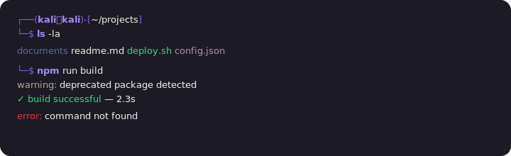
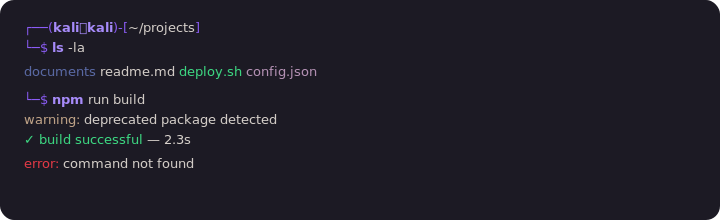
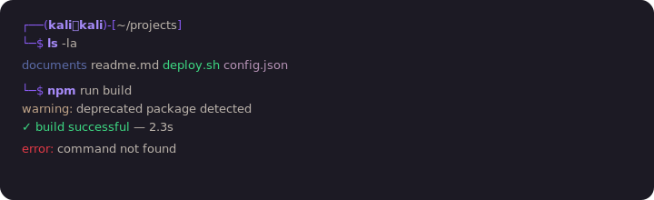
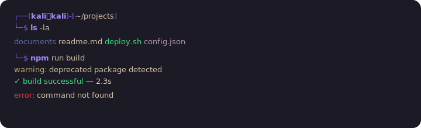
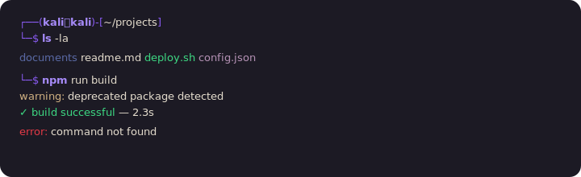

# Exclusive

A warm, dark-cream terminal theme built around an intense purple, with calm beige warnings, ruby-red errors, vivid green successes, and pastel cerulean comments. Designed for legibility in long sessions.

Includes installer for:

- **qterminal** (qtermwidget5 / qtermwidget6) — Kali, LXQt, etc.
- **gnome-terminal** — optional, via dconf
- **Cascadia Code** font — optional, via apt

> Inspired in form by the [Rosé Pine](https://github.com/rose-pine/gnome-terminal) repository structure.

## Variants

Five flavours share the same palette but vary in **foreground tone**, so you can match the theme to your mood and lighting.

### ExclusiveBone — bone-white text, luminous and refined (recommended)



### ExclusiveAsh — light ash grey, balanced and sober



### ExclusiveTea — mid ash grey, calm and mineral



### ExclusiveSand — deep sandy beige, warm and earthy



### ExclusiveMidnight — warm cream, vintage golden hour



All variants share the same purple, ruby, emerald, cerulean and mauve accents.

## Quick install

```bash
git clone https://github.com/nebzn/exclusive-theme.git
cd exclusive-theme
./exclusive install
```

The installer will:

1. Detect your terminal (qterminal version, gnome-terminal).
2. Show an interactive variant chooser (1-6).
3. Install the chosen variant (or all five) to qterminal.
4. Optionally also add the variants as gnome-terminal profiles.
5. Ask `y/n` if you want to install the **Cascadia Code** font.
6. Print final instructions to apply it via Preferences.

### Command examples

```bash
./exclusive                              # interactive menu
./exclusive install                      # interactive variant chooser
./exclusive install ExclusiveBone        # install one specific variant
./exclusive install ExclusiveSand        # ...any variant name works
./exclusive install-all                  # install every variant at once
./exclusive uninstall                    # remove every Exclusive theme
./exclusive --help
```

## Apply the theme

After running the installer:

1. **Close qterminal completely** and reopen it (it only loads color schemes at startup).
2. **Preferences → Appearance**.
3. **Color scheme** → choose `ExclusiveBone` (or any installed variant).
4. **Font** → click `Change…` → choose `Cascadia Code` (size `11` or `12`).
5. Click **Apply** → **OK**.

For gnome-terminal: open Preferences and select the corresponding profile.

## What gets installed

| File | Destination |
|---|---|
| `themes/qterminal/Exclusive*.colorscheme` | `/usr/share/qtermwidget{5\|6}/color-schemes/` |
| `themes/gnome-terminal/Exclusive*.dconf` | imported as new gnome-terminal profiles |
| `fonts/` (Cascadia Code) | installed via `sudo apt install fonts-cascadia-code` |

## Manual install (without the script)

```bash
# qterminal — pick one variant
sudo cp themes/qterminal/ExclusiveBone.colorscheme /usr/share/qtermwidget6/color-schemes/

# Cascadia Code font
sudo apt install -y fonts-cascadia-code
```

Then apply from qterminal Preferences as above.

## Palette reference

See [`docs/PALETTE.md`](docs/PALETTE.md) for the full color table in hex and RGB — useful for porting the theme to VS Code, Neovim, tmux, Alacritty, etc.

## Uninstall

```bash
./exclusive uninstall
```

Removes every `Exclusive*.colorscheme` from the qterminal system and user directories. gnome-terminal profiles aren't removed automatically — delete them from gnome-terminal's Preferences UI if you no longer want them.

## License

MIT — do what you want.

---

<sub>Powered by AI — Anthropic Claude Opus 4.7</sub>
